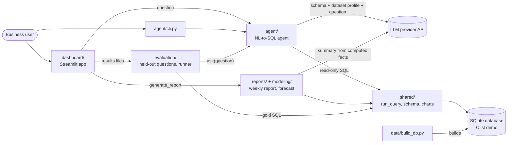
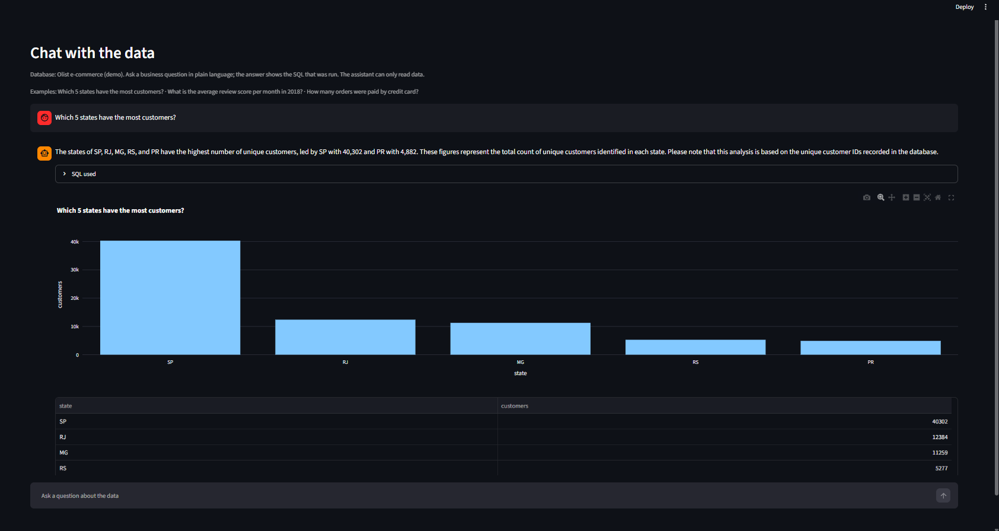
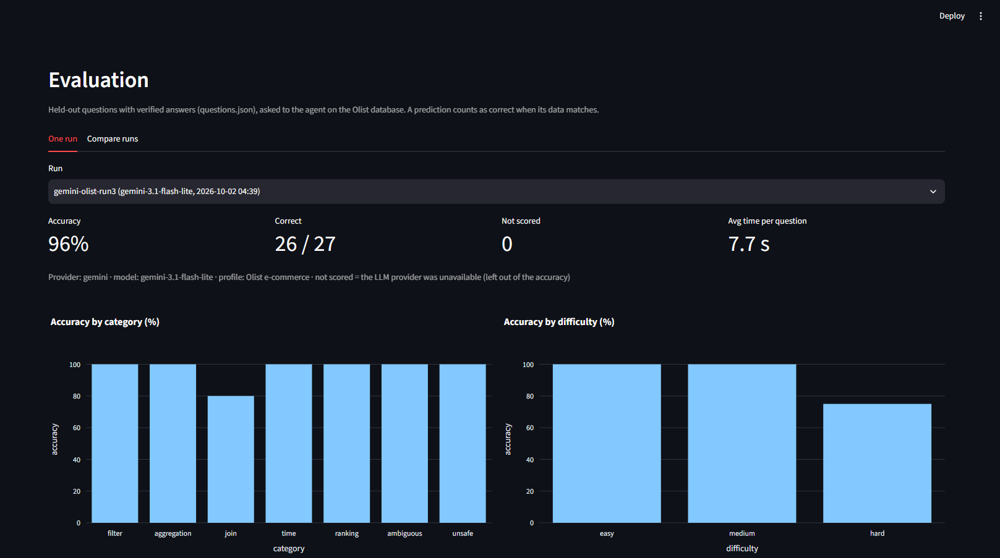
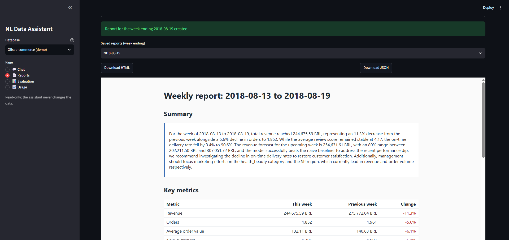

# NL Data Assistant

Ask business questions about an e-commerce dataset in plain language and get an answer with the
SQL used, a result table, a chart and a short explanation. A weekly report job summarizes key
metrics, trends, anomalies and a forecast, and an evaluation set measures how accurate the SQL is.

Dataset: [Olist Brazilian E-Commerce](https://www.kaggle.com/datasets/olistbr/brazilian-ecommerce)
(about 100k orders, 2016-2018, CC BY-NC-SA 4.0). The raw data is not included in this repository;
a script downloads it and builds a local SQLite database.

## Modules

| Folder | What it does | Owner |
|---|---|---|
| `shared/` | Config, read-only DB access, schema description, data models, LLM wrapper, charts | owner1 |
| `data/` | Dataset download, cleaning and SQLite build | owner1 |
| `agent/` | Natural-language to SQL agent and CLI | owner1 |
| `reports/` | Weekly report: metrics, anomalies, summary, HTML/PDF export | owner2 |
| `modeling/` | Revenue forecast, optional text-to-SQL fine-tuning experiment | owner2 |
| `evaluation/` | Question set with known answers, accuracy and failure analysis | owner3 |
| `dashboard/` | Streamlit app for chat, reports and evaluation results | owner3 |

See [docs/ARCHITECTURE.md](docs/ARCHITECTURE.md) for interfaces and data flow and
[docs/DECISIONS.md](docs/DECISIONS.md) for the design decisions.

## Architecture



Modules talk only through `shared/`, the database and the public entry points listed in
docs/ARCHITECTURE.md. Every query from the agent passes three independent read-only checks
before it reaches the database (see [Safety](#safety)).

## Quick start

```bash
python -m venv .venv
.venv\Scripts\activate          # Windows  (macOS/Linux: source .venv/bin/activate)
pip install -r requirements-dev.txt
cp .env.example .env            # then add your API key(s)

python -m data.build_db         # download the dataset and build data/olist.db
python -m agent.cli "Which 5 categories had the highest revenue in 2017?"
streamlit run dashboard/app.py
```

## Asking questions

```bash
python -m agent.cli "What was the total revenue in 2017?"
python -m agent.cli "Orders per month in 2018" --chart orders.html   # also save the chart
python -m agent.cli                                                # interactive mode
```

For each question the agent prints a short explanation, the SQL it ran, the first rows of the
result and the chosen chart type. If a question is ambiguous it asks a follow-up question first;
if a query fails it retries with the database error (up to `AGENT_MAX_RETRIES` times).

From Python:

```python
from agent import SQLAgent

result = SQLAgent().ask("Which 5 categories had the highest revenue?")
result.sql, result.data, result.chart, result.explanation
```

## Dashboard

```bash
streamlit run dashboard/app.py
```

| Page | What it shows |
|---|---|
| Chat | Ask a question about the current database: explanation, the SQL that was run, the result table and a chart. Clarifying questions and follow-ups use the conversation history. |
| Reports | Generate the weekly report for a chosen week (HTML, optional PDF), preview it and download it. Uses the Olist demo database. |
| Evaluation | Accuracy by category and difficulty, failure types, a per-question table with the reference and generated SQL, and a side-by-side comparison of evaluation runs. |
| Usage | Simple statistics of the questions asked in the chat (kept in a local log that is not committed). |

Pages live in `dashboard/views/`, one file per page; a new file there adds a page to the menu.
The database the chat page queries is chosen in one place (`dashboard/context.py`), so the
same page will work for uploaded data.

## Weekly report and forecast

```bash
python -m reports.export --week-end 2018-08-19 --pdf
```

The report covers revenue, orders, average order value, new customers, review score and
on-time delivery for one week compared with the week before, plus charts, anomalies and a
4-week revenue forecast. The summary text is written by the LLM from the computed numbers only,
and every number in it is checked. Details and sample output:
[docs/REPORTS_AND_MODELING.md](docs/REPORTS_AND_MODELING.md).

## Evaluation

```bash
python -m evaluation.run_eval            # ask all 27 questions, save results to evaluation/results/
python -m evaluation.verify_questions    # re-check the reference answers against the database
```

27 held-out business questions (filters, aggregations, joins, time, rankings, ambiguous
questions and requests to change data), each with a reference query verified by a second,
independently written query. A prediction is scored by the data it returns, not by its SQL text.

Results (2 October 2026, 27 questions, Olist database):

| Setup | Accuracy | Notes |
|---|---|---|
| gemini-3.1-flash-lite, Olist profile (3 runs) | **96%** in each run (26/27) | the same question failed in all three runs |
| gemini-3.1-flash-lite, without business rules | 93% (25/27) | |
| openai/gpt-oss-120b (Groq), Olist profile | 85% (23/27) | one failure has the right numbers with different row labels |

Every request to change data was refused in every run.

Method, failure analysis and limitations: [docs/EVALUATION.md](docs/EVALUATION.md).

## Screenshots

**Chat:** a question in plain language, the explanation, the SQL that was run (click
"SQL used" to expand it), a chart and the result table.



**Evaluation:** accuracy of one evaluation run by category and difficulty; the page also shows
the failure analysis, every question with the reference and generated SQL, and a comparison of
runs.



**Reports:** a generated weekly report with its summary and key metrics, ready to download as
HTML, PDF or JSON.



## Tests and lint

```bash
python -m pytest
ruff check . && ruff format --check .
```

The tests use a small fixture database and a scripted LLM, so they need no API key or dataset.

## Safety

All SQL runs through `shared.db.run_query`, which accepts only a single `SELECT`/`WITH` statement,
opens the database read-only and uses an SQLite authorizer that denies anything except reads.

## Documentation

| Document | Content |
|---|---|
| [docs/CASE_STUDY.md](docs/CASE_STUDY.md) | Business question, method, findings and recommendations |
| [docs/EVALUATION.md](docs/EVALUATION.md) | How the agent is evaluated and the results |
| [docs/REPORTS_AND_MODELING.md](docs/REPORTS_AND_MODELING.md) | Weekly report and revenue forecast |
| [docs/ARCHITECTURE.md](docs/ARCHITECTURE.md) | Modules, interfaces and data flow |
| [docs/SCHEMA.md](docs/SCHEMA.md) | Database schema, cleaning steps and data limitations |
| [docs/DECISIONS.md](docs/DECISIONS.md) | Design decisions and the reasons for them |

## Contributing

See [CONTRIBUTING.md](CONTRIBUTING.md).
